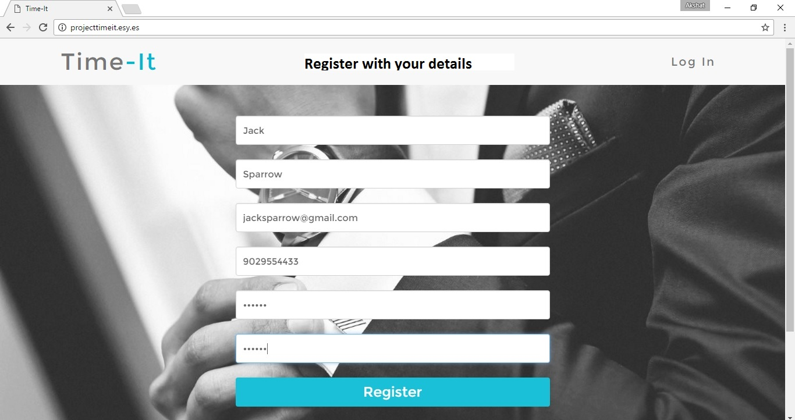
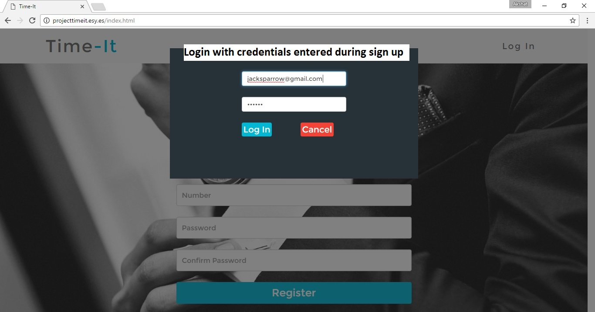
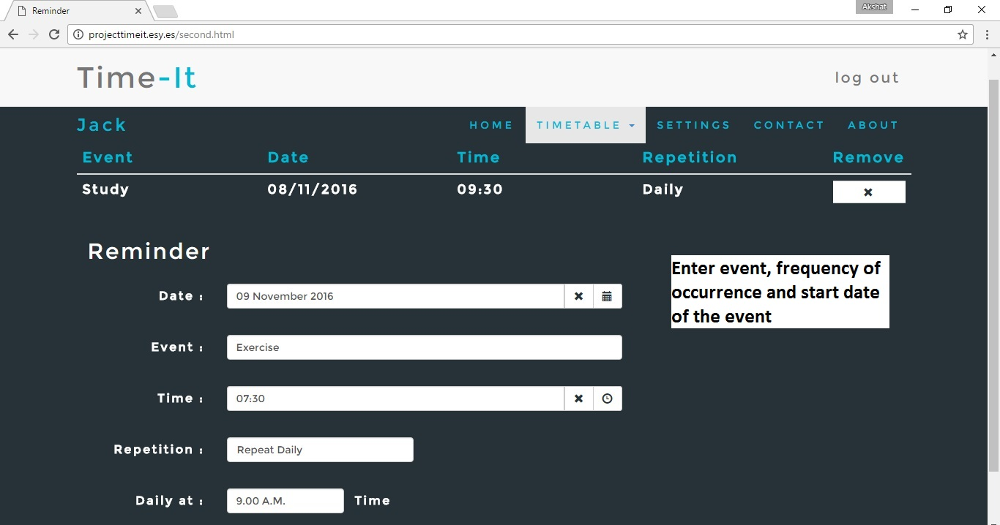
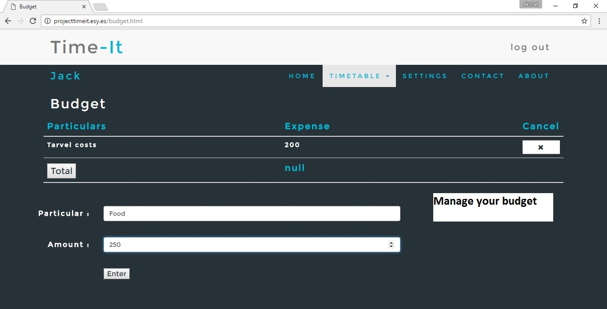

Time-it is a platform to set your tasks and remind yourself. In today's busy world, we usually tend to forget our tasks. This is where Time-it steps in. We keep a record of all your tasks and remind you from time to time about your registered tasks using email and text message.

The site is developed with Bootstrap and hence compatible with multiple devices.

#### How to Use?
- The user registers himself on the website and logs in.
- Then he has to set reminders according to his needs with proper details.
  - Event: The name of the event
  - Date: The date on which he wants to receive the reminder
  - Time: The time of the task
  - Repetition: It has basically 4 options-
    1. Never
    2. Daily
    3. Weekly
    4. Monthly
- User can also enter details of his daily expense in budget and obtain the total any time he wants.
- You will then get an email and an SMS one hour before the task has to be performed.

##### Tools used: HTML, CSS, Bootstrap, JavaScript, AJAX, PHP

Developed by: [Akshat Barbhaya](https://www.linkedin.com/in/akshat-21/), [Sagar Dedhia](https://www.linkedin.com/in/sagar-dedhia/)
